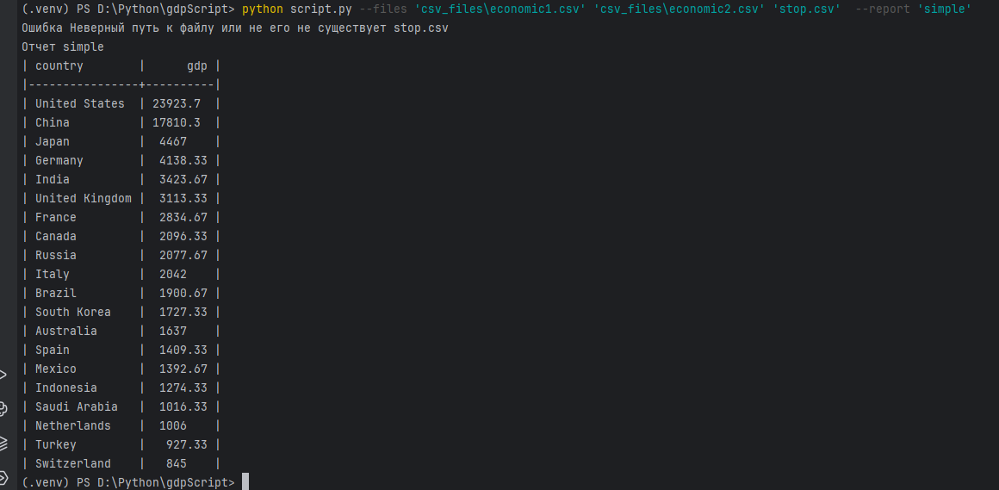

# GDP Analyzer
## Проект в рамках тествого задания
**Анализ экономических данных из CSV файлов**


постарался следовать тз ничего лишнего не добавлять 
тесты написаны с использованием pytest 
архитекуру старался сделать расширяемой и маштабируемой 
постарался также учесть возможные ошибки ввода пути для пользователем за это отвечает функция в  'utils.py'
библиотеки использовал argparse, tabulate, pytest 
## Архитектура

- `script.py` - основной скрипт
- `reports.py` - класс Report для отчетов
- `tables.py` - форматирование вывода класс table
- `utils.py` - вспомогательные функции
- `tests/test_reports.py` - тесты
## Быстрый старт

```bash
git clone https://github.com/anor32/sciptReport
cd sciptReport

python -m venv venv
venv\Scripts\activate  
# source venv/bin/activate  

pip install -r requirements.txt
```

## Использование

```bash
python  python script.py --files 'csv_files\economic1.csv' 'csv_files\economic2.csv ' --report 'simple'           

```
### пример запуска


## Тесты

```bash
pytest tests/ -v
pytest tests/ --cov=reports --cov=utils --cov-report=term-missing
```

